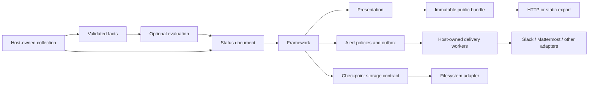

# Embeddable status framework

The framework consumes validated status documents supplied by its host. It does
not probe endpoints, start scrapers, discover services or choose a collection
schedule. The host decides how to obtain observations and represent unavailable
or stale data. Rhai is optional: callers can submit already evaluated statuses.

These packages are unpublished internal workspace APIs, usable as path
dependencies. A supported library release and compatibility policy will follow
experience with additional consumers.

## Packages

| Crate | Responsibility |
| --- | --- |
| `status-model` | Validated IDs, timestamps, bounded facts, components and complete status documents |
| `status-evaluation` | Compile and evaluate Rhai conditions over supplied facts; no I/O |
| `status-publication` | Public artifacts, renderer contract and immutable shared publications |
| `status-alerting` | Delivery API, per-route policies, grace/recovery transitions, outbox and leases |
| `status-alert-webhook` | Slack, Mattermost and generic JSON adapters; owns credentials and HTTP client |
| `status-checkpoint` | Backend-neutral checkpoint representation, storage contract and opaque handle |
| `status-framework` | Persist documents and alert intents, render and publish, coordinate delivery claims/results |
| `status-framework-fs` | Writer lock, atomic private checkpoints and previous-checkpoint recovery |
| `status-theme` | Default HTML/JSON presentation with an optional Tera template |
| `status-http` | Serve registered immutable public artifacts through Actix |
| `status-feed` | Example composition accepting JSON files and optional rules/alert configuration |



The model, evaluation and alert contracts have no network clients or web framework
dependencies. Dependency tests reject paths from reusable packages to CVMFS
packages. Each crate can be built and tested independently.

The existing `status-domain`, `status-application`, `status-sources`,
`status-storage`, `status-storage-fs` and `status-presentation` retain CVMFS domain
behavior, historical formats and public compatibility. Public artifacts and HTTP
serving are shared with the framework. CVMFS operational routes remain in its
composition package. `Generator::generate_observed` accepts already collected
observations for embedding that existing pipeline.

## Input and evaluation

A `StatusDocument` has a title, generation time and components. Each component has
a stable ID, label, optional group, health, explanation and observation time.
IDs and timestamps are validated; duplicates and future observations are rejected.
Text and fact counts are bounded. Deserialized documents pass through the same
constructors used by Rust callers.

Documents replace the complete view. Omission removes a component; it does not
claim recovery. Submit `unknown` when unavailable observations should stay visible.
Freshness, aggregation, maintenance and threshold semantics belong to the caller.
Alert transitions advance when new documents arrive. A host that needs freshness
deadlines must submit updated documents when those deadlines expire.
Generation times must not move backwards. Multiple updates within the same second
are accepted; event sequence numbers distinguish their alert transitions.

`RuleSet` compiles ordered boolean expressions once and returns the first match.
Rules access bounded input such as `facts.age_seconds > 300`. Each condition gets
fresh constant input. Missing facts, wrong return types and execution failures
return errors; the host chooses how to represent them. A caller-selected fallback
applies when no condition matches.

Rhai has operation, expression-depth, call-depth and collection-size limits.
Dynamic evaluation, imports, loops and print/debug entry points are disabled.
No filesystem, network or process functions are registered. These control
interpreter work; they are not process isolation. Rules and templates remain
trusted operator configuration. Keep evaluation, persistence and rendering off
HTTP workers. See Rhai's [compilation](https://rhai.rs/book/engine/compile.html)
and [operation limits](https://rhai.rs/book/safety/max-operations.html) documentation.

## Alert policies and adapters

Each route identifies a destination and has its own triggering health states,
optional component selection and policy:

| Setting | Meaning |
| --- | --- |
| Firing grace | Sustained triggering state before notification |
| Recovery grace | Sustained non-triggering state before recovery notification |
| Repeat interval | Optional reminders while an incident remains active |
| Timeout | Maximum duration of one delivery attempt |
| Retry delay | Initial delay, increasing exponentially up to one hour |
| Maximum attempts | Exhausted deliveries become inspectable dead letters |

Changes between triggering severities do not renew firing grace. Brief failures
and recoveries reset their respective pending transition. State and queued events
survive restart. This is separate from CVMFS replication deadlines, which remain
domain-specific.

`AlertSink` is the adapter API. Email, X or other integrations can implement it
without changing rules, templates or the framework. The first implementations use
[Slack incoming webhooks](https://docs.slack.dev/messaging/sending-messages-using-incoming-webhooks/)
and [Mattermost incoming webhooks](https://developers.mattermost.com/integrate/webhooks/incoming/).
A versioned generic JSON webhook payload is also available. Formatting,
credentials, connections and provider errors belong to the adapter. Policies see
route IDs and delivery outcomes, never credentials.

The host calls `Engine::claim_deliveries` for a bounded batch, sends it on separate
network workers through `status_framework::deliver`, and returns results through
`Engine::complete_delivery`. Claims are durable before requests begin. One lease
per route limits concurrency, and events for each component remain ordered.
Rate limits can extend retries. Dead letters are visible through
`alert_state().dead_letters()` and can be retried through `retry_dead_letter` after
the underlying problem is corrected.

Delivery is **at least once**: a crash after remote acceptance but before local
acknowledgement can cause a duplicate. Event IDs remain stable across retries;
webhooks carry an `Idempotency-Key`, but Slack and Mattermost are not assumed to
deduplicate it. An expired worker cannot acknowledge a newer lease. Pending events
and tracked states are bounded; reaching capacity returns backpressure.

Webhook URLs require HTTPS and redirects are disabled. Shared errors omit URLs
and response bodies. Slack uses plain-text blocks; Mattermost formatting suppresses
source-supplied mentions and Markdown links. The host controls approved destinations
and network egress. Constructing an adapter does not send an alert.

## Persistence and publication

The opaque `status_checkpoint::Store` accepts complete checkpoints. A production backend implements
atomic durable save, validated recovery and exclusive writer ownership. It does
not need CVMFS replication or history methods, and never depends on the engine.

Updates first persist the supplied document and alert intents, retaining the old
public bundle. Rendering and a second durable save make the new bundle eligible
for publication. Readers hold immutable snapshots. Rendering/publication failures
retain the last public bundle while preserving facts and alert state.
`publish_current` retries rendering without recording the input again.

The file adapter uses owner-only temporary files, file and directory synchronization,
and a previous committed checkpoint. Unrelated staging files are ignored. Corrupt
state without a valid backup is an error; silently discarding it would renew grace
and lose delivery intent. Back up state with the writer stopped and keep it outside
public export paths.

Compatibility covers caller schema/rule identity, renderer identity and alert
policies. Changes require explicit migration or a new state location; this branch
does not reset incompatible state automatically. The generic store preserves
current observations and alerts. General-purpose historical queries and rollups
remain future work; CVMFS history is unchanged.

## Example

The example collects nothing. Its input can mix already evaluated health with
facts evaluated through an optional rule set:

```sh
cargo run -p status-feed -- \
  --input apps/status-feed/examples/jobs.json \
  --rules apps/status-feed/examples/rules.json \
  --state-directory feed-state \
  --output-directory feed-public
```

Serve `feed-public/index.html` with your static server. Supply
`--template path/to/status.html` to customize it; templates receive `page` (the
status document) and `generated_at` (a formatted UTC time). The default template
embeds its styles and escapes component values.

Add `--alerts apps/status-feed/examples/alerts.json` to enable alert policies.
Repeated invocations submit documents and advance grace. Without `--deliver-alerts`,
events are saved but no external messages are sent. To deliver, provide the
configured `STATUS_SLACK_WEBHOOK` and `STATUS_MATTERMOST_WEBHOOK` environment
variables and explicitly add `--deliver-alerts`. Keep their values in your secret
manager or deployment environment, not a committed JSON file.

Each invocation performs one update and one bounded delivery batch. A continuous
host owns its input queue, scheduling, delivery workers and shutdown. It should
stop accepting inputs, finish state mutations and await bounded delivery attempts;
unacknowledged leases recover after restart. It can serve the published bundles
through `status-http`.

## Verification and next work

Tests cover validation, rule isolation, escaping, grace/recovery flapping, durable
leases, retry ordering, dead letters, failed render/publication, locks, corruption
recovery and the JSON-fed binary. Webhook tests use loopback fixtures only.
Generator/HTTP parity fixtures protect CVMFS compatibility. Container builds verify
workspace manifests and embedded inputs.

Further independent work can add historical queries, more themes and delivery
adapters, checkpoint migrations, and a continuous-input host. Authenticated
administration, dynamic plugin loading, arbitrary command execution and multiple
writers need explicit contracts and consumers of their own.
